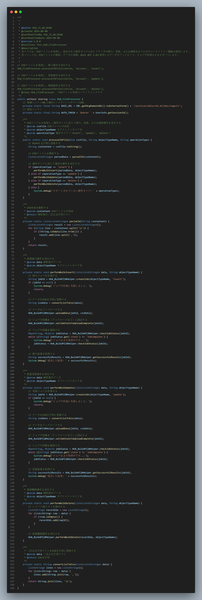

# HUA\_FileProcessor 使用手册

## 作者

HUA\_JI\_WU\_NIAN

## 作成日

2024年10月17日

## 更新日

2024年10月17日

## 目的

`HUA_FileProcessor` クラスは、CSV ファイルを処理し、指定された操作タイプに応じてデータの挿入、更新、または削除を行うためのユーティリティ機能を提供します。各メソッドは、CSV ファイルの解析、データの変換、Bulk API 2.0 を使用したデータのアップロード、ジョブの管理などをサポートします。

## 目次

* [サマリー](vscode-webview://1mum1qmts0f7ov18kqmmvtkb33v002a4qaiced8phjoali8gmqre/index.html?id=a9bb55de-a67e-4ddc-83bb-7f8147cccbca&origin=58bc19a6-1346-40a8-91d5-ede7d47bf538&swVersion=4&extensionId=Alibaba-Cloud.tongyi-lingma&platform=electron&vscode-resource-base-authority=vscode-resource.vscode-cdn.net&parentOrigin=vscode-file%3A%2F%2Fvscode-app&purpose=webviewView#%E3%82%B5%E3%83%9E%E3%83%AA%E3%83%BC)
* [メソッドリスト](vscode-webview://1mum1qmts0f7ov18kqmmvtkb33v002a4qaiced8phjoali8gmqre/index.html?id=a9bb55de-a67e-4ddc-83bb-7f8147cccbca&origin=58bc19a6-1346-40a8-91d5-ede7d47bf538&swVersion=4&extensionId=Alibaba-Cloud.tongyi-lingma&platform=electron&vscode-resource-base-authority=vscode-resource.vscode-cdn.net&parentOrigin=vscode-file%3A%2F%2Fvscode-app&purpose=webviewView#%E3%83%A1%E3%82%BD%E3%83%83%E3%83%89%E3%83%AA%E3%82%B9%E3%83%88)
  * [processCSVFile](vscode-webview://1mum1qmts0f7ov18kqmmvtkb33v002a4qaiced8phjoali8gmqre/index.html?id=a9bb55de-a67e-4ddc-83bb-7f8147cccbca&origin=58bc19a6-1346-40a8-91d5-ede7d47bf538&swVersion=4&extensionId=Alibaba-Cloud.tongyi-lingma&platform=electron&vscode-resource-base-authority=vscode-resource.vscode-cdn.net&parentOrigin=vscode-file%3A%2F%2Fvscode-app&purpose=webviewView#processcsvfile)
  * [parseCSV](vscode-webview://1mum1qmts0f7ov18kqmmvtkb33v002a4qaiced8phjoali8gmqre/index.html?id=a9bb55de-a67e-4ddc-83bb-7f8147cccbca&origin=58bc19a6-1346-40a8-91d5-ede7d47bf538&swVersion=4&extensionId=Alibaba-Cloud.tongyi-lingma&platform=electron&vscode-resource-base-authority=vscode-resource.vscode-cdn.net&parentOrigin=vscode-file%3A%2F%2Fvscode-app&purpose=webviewView#parsecsv)
  * [performBulkInsert](vscode-webview://1mum1qmts0f7ov18kqmmvtkb33v002a4qaiced8phjoali8gmqre/index.html?id=a9bb55de-a67e-4ddc-83bb-7f8147cccbca&origin=58bc19a6-1346-40a8-91d5-ede7d47bf538&swVersion=4&extensionId=Alibaba-Cloud.tongyi-lingma&platform=electron&vscode-resource-base-authority=vscode-resource.vscode-cdn.net&parentOrigin=vscode-file%3A%2F%2Fvscode-app&purpose=webviewView#performbulkinsert)
  * [performBulkUpdate](vscode-webview://1mum1qmts0f7ov18kqmmvtkb33v002a4qaiced8phjoali8gmqre/index.html?id=a9bb55de-a67e-4ddc-83bb-7f8147cccbca&origin=58bc19a6-1346-40a8-91d5-ede7d47bf538&swVersion=4&extensionId=Alibaba-Cloud.tongyi-lingma&platform=electron&vscode-resource-base-authority=vscode-resource.vscode-cdn.net&parentOrigin=vscode-file%3A%2F%2Fvscode-app&purpose=webviewView#performbulkupdate)
  * [performBulkDelete](vscode-webview://1mum1qmts0f7ov18kqmmvtkb33v002a4qaiced8phjoali8gmqre/index.html?id=a9bb55de-a67e-4ddc-83bb-7f8147cccbca&origin=58bc19a6-1346-40a8-91d5-ede7d47bf538&swVersion=4&extensionId=Alibaba-Cloud.tongyi-lingma&platform=electron&vscode-resource-base-authority=vscode-resource.vscode-cdn.net&parentOrigin=vscode-file%3A%2F%2Fvscode-app&purpose=webviewView#performbulkdelete)
  * [convertListToCsv](vscode-webview://1mum1qmts0f7ov18kqmmvtkb33v002a4qaiced8phjoali8gmqre/index.html?id=a9bb55de-a67e-4ddc-83bb-7f8147cccbca&origin=58bc19a6-1346-40a8-91d5-ede7d47bf538&swVersion=4&extensionId=Alibaba-Cloud.tongyi-lingma&platform=electron&vscode-resource-base-authority=vscode-resource.vscode-cdn.net&parentOrigin=vscode-file%3A%2F%2Fvscode-app&purpose=webviewView#convertlisttocsv)

## サマリー

`HUA_FileProcessor` は、Salesforce Apex クラスで、CSV ファイルを処理し、指定された操作タイプに応じてデータの挿入、更新、または削除を行うための複数の静的メソッドを提供します。これらのメソッドは、CSV ファイルの解析、データの変換、Bulk API 2.0 を使用したデータのアップロード、ジョブの管理などをサポートします。

## メソッドリスト

### processCSVFile

**機能**：CSV ファイルを処理し、指定された操作タイプに応じてデータの挿入、更新、または削除を実行します。

**パラメータ**：

* `csvFile` (Blob)：CSV ファイルの内容。
* `objectTypeName` (String)：オブジェクトのタイプ名。
* `operationType` (String)：実行する操作（例: `insert`, `update`, `delete`）。

### parseCSV

**機能**：CSV 内容を解析します。

**パラメータ**：

* `csvContent` (String)：CSV ファイルの内容。

**戻り値**：解析後の二次元文字列リスト。

### performBulkInsert

**機能**：批量插入操作を実行します。

**パラメータ**：

* `data` (List<List<String>>)：解析後のデータ。
* `objectTypeName` (String)：オブジェクトのタイプ名。

### performBulkUpdate

**機能**：批量更新操作を実行します。

**パラメータ**：

* `data` (List<List<String>>)：解析後のデータ。
* `objectTypeName` (String)：オブジェクトのタイプ名。

### performBulkDelete

**機能**：批量删除操作を実行します。

**パラメータ**：

* `data` (List<List<String>>)：解析後のデータ。
* `objectTypeName` (String)：オブジェクトのタイプ名。

### convertListToCsv

**機能**：二次元文字列リストを CSV 文字列に変換します。

**パラメータ**：

* `data` (List<List<String>>)：二次元文字列リスト。

**戻り値**：CSV 文字列。

## 使用例

### CSV ファイルの処理と挿入操作の例

<pre>

apex

<svg width="1em" height="1em" fill="currentColor" aria-hidden="true" focusable="false" class=""><use xlink:href="#yunxiao-insert-line1"></use></svg><svg width="1em" height="1em" fill="currentColor" aria-hidden="true" focusable="false" class=""><use xlink:href="#yunxiao-copy-line"></use></svg><svg width="1em" height="1em" fill="currentColor" aria-hidden="true" focusable="false" class=""><use xlink:href="#yunxiao-additive-code-file-line"></use></svg>

<code class="language-apex">// CSV ファイルを処理し、挿入操作を実行する
HUA_FileProcessor.processCSVFile(csvFile, 'Account', 'insert');</code>

</pre>

### CSV ファイルの処理と更新操作の例

<pre>

apex

<svg width="1em" height="1em" fill="currentColor" aria-hidden="true" focusable="false" class=""><use xlink:href="#yunxiao-insert-line1"></use></svg><svg width="1em" height="1em" fill="currentColor" aria-hidden="true" focusable="false" class=""><use xlink:href="#yunxiao-copy-line"></use></svg><svg width="1em" height="1em" fill="currentColor" aria-hidden="true" focusable="false" class=""><use xlink:href="#yunxiao-additive-code-file-line"></use></svg>

<code class="language-apex">// CSV ファイルを処理し、更新操作を実行する
HUA_FileProcessor.processCSVFile(csvFile, 'Account', 'update');</code>

</pre>

### CSV ファイルの処理と削除操作の例

<pre>

apex

<svg width="1em" height="1em" fill="currentColor" aria-hidden="true" focusable="false" class=""><use xlink:href="#yunxiao-insert-line1"></use></svg><svg width="1em" height="1em" fill="currentColor" aria-hidden="true" focusable="false" class=""><use xlink:href="#yunxiao-copy-line"></use></svg><svg width="1em" height="1em" fill="currentColor" aria-hidden="true" focusable="false" class=""><use xlink:href="#yunxiao-additive-code-file-line"></use></svg>

<code class="language-apex">// CSV ファイルを処理し、削除操作を実行する
HUA_FileProcessor.processCSVFile(csvFile, 'Account', 'delete');</code>

</pre>

### 注意事項

* Salesforce の接続と権限が適切に設定されていることを確認してください。
* 本番環境で使用する場合は、デバッグと監視を効率化するためにエラー処理とログを追加することをお勧めします。
